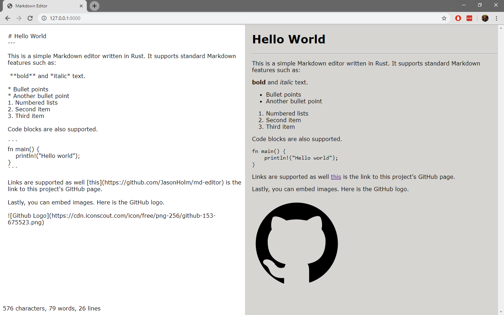

# Markdown Editor
Copyright (c) 2019 Jessica Holm

This program is a basic Markdown editor as a web application.
It relies on [Yew](https://github.com/yewstack/yew), [stdweb](https://github.com/koute/stdweb), and [comrak](https://github.com/kivikakk/comrak).

## Example
Here's a screenshot of the program running.



## Build and Run
This program runs via cargo-web.

### Install cargo-web
```bash
cargo install cargo-web
```

### Build
```bash
cargo web build
```

### Run
```bash
cargo web start
```

## Testing
Tests also run via cargo-web.

```bash
cargo web test
```

## License
This program is licensed under the "MIT License". Please
see the file `LICENSE` for license terms.
